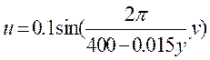
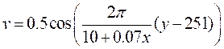

# DIC-benchmark-dataset
A collection of simulated 2D-DIC datasets designed for benchmarking digital image correlation (DIC) algorithms. The speckle images are generated using cubic B-spline interpolation algorithm, allowing researchers to systematically evaluate the robustness, generalization, and accuracy of different methods.

| Data | **Evaluation purpose**                           | **Resolution (pixels)** | **Noise level (gray levels)** | **Deformation type**                                         |
| ---- | ------------------------------------------------ | ----------------------- | ----------------------------- | ------------------------------------------------------------ |
| #1   | Robustness to image noise                        | 500×500                 | 1, 2, 3, 4, 5                 | Horizontal translation of 0.3 pixels                         |
| #2   | Generalization capability to speckle patterns    | 500×500                 | 5                             | Horizontal translations ranging from 0 to 1 pixel (step: 0.1 pixels) |
| #3   | Measurement accuracy for different  deformations | 500×500                 | 2                             | Rotations from 0° to 60° anticlockwise in 10° steps, centered around the image center |
| #4   | Measurement accuracy for different  deformations | 500×500                 | 2                             | Horizontal tensile deformations with elongation rates of 0.2%, 0.4%, 0.6%, 0.8%, 0.1% |
| #5   | Measurement accuracy for different  deformations | 2000×501                | 2                             | Sinusoidal deformation:      |
| #6   | Measurement accuracy for different  deformations | 2000×501                | 2                             | Star-shaped deformation:  |

```bash
DIC-benchmark-dataset/
│── data/
│   ├── data#1/   # Noise robustness test
│   ├── data#2/   # Speckle pattern generalization
│   ├── data#3/   # Rotation deformation
│   ├── data#4/   # Tensile deformation
│   ├── data#5/   # Sinusoidal deformation
│   └── data#6/   # Star-shaped deformation
│
│── assets/     # Figures for dataset illustration
│── README.md   # Project description
│── LICENSE     # License file
```

